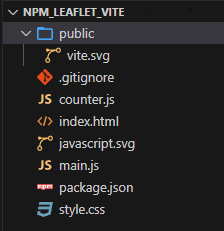
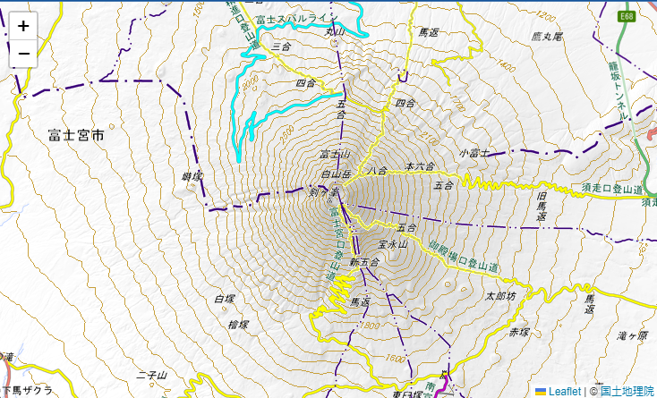
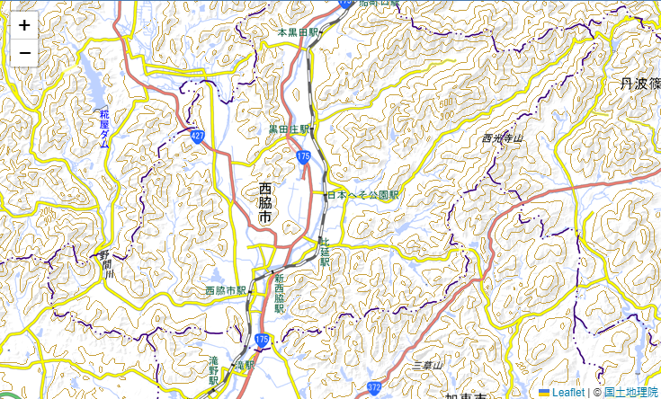

# Viteを利用してvanilla＋npmを利用できる環境を作成する

## はじめに

(Webアプリの場合)npmでインストールしたライブラリは、CDNから読み込むような感じでは使えません

`import`や `require`でライブラリを読み込み、さらにそれを[バンドル](https://qiita.com/kome1996/items/1731e53cfefed79eafcc)する必要があります

以前、[rollup.js](https://rollupjs.org/)を使って[ビルドする手順](https://qiita.com/murasuke/items/0ccc088b3a4dde8bf385)を作成したのですが、Hot Module Replacement(HMR、JSの変更を即時でブラウザに適用する機能)ができないため、ちょっとした修正のたびにビルドを行う必要があり面倒でした。

そこでこの記事では、[Vite](https://ja.vitejs.dev/)を利用して、HMRが行われる快適な環境を作成してみます。

### viteでテンプレート(`vanilla`)を生成

[vanilla](https://ja.wikipedia.org/wiki/%E3%83%90%E3%83%8B%E3%83%A9_(%E3%82%BD%E3%83%95%E3%83%88%E3%82%A6%E3%82%A7%E3%82%A2))とは

日本語に訳すと「素の」、「原型のまま」といった意味です(バニラ味はアイスの「デフォルト」や「プレーン」な味というイメージだから)

ライブラリもフレームワークも使わないで JS を書くことを`Vanilla JS`と呼びます

テンプレートには、`vanilla`以外にも`React`や`Vue`用が用意されています。

```bash
$ npm create vite@latest npm_leaflet_vite -- --template vanilla

Scaffolding project in E:\Users\tkykn\git\bundle\npm_leaflet_vite...

Done. Now run:

  cd npm_leaflet_vite
  npm install
  npm run dev
```
vanillaテンプレートは下記ファイルが生成されました



### viteとleafletをインストール
```bash
$ cd npm_leaflet_vite
$ npm install
$ npm i leaflet
```

### テンプレートに含まれる不要なファイルを削除

```bash
$ rm style.css javascript.svg counter.js
```

### main.jsファイルの書き換え(leaflet.jsで地図を表示する)

[Leaflet](https://leafletjs.com/)公式[Quick Start Guide](https://leafletjs.com/examples/quick-start/#:~:text=example%20stand%2Dalone.-,Preparing%20your%20page,-Before%20writing%20any)ページのサンプルをもとに、地図を国土地理院の[地理院タイル](https://maps.gsi.go.jp/development/ichiran.html)に変更したサンプルプログラムです

実行すると富士山頂を中心とした地図が表示されます


```javascript:main.js
// npmでインストールしたライブラリをimport
import L from 'leaflet';
import 'leaflet/dist/leaflet.css';

const latLen = [35.3607411, 138.727262]; // 富士山頂の緯度経度
const map = L.map('app'); // 地図を生成
map.setView(latLen, 12); // 緯度経度、ズームレベルを設定
// タイルレイヤを生成し、地理院タイルを地図に追加
L.tileLayer('https://cyberjapandata.gsi.go.jp/xyz/std/{z}/{x}/{y}.png', {
  attribution: '&copy; <a href="https://maps.gsi.go.jp/development/ichiran.html">国土地理院</a>',
}).addTo(map);

// mapをエクスポートする
export default map;
```

### index.htmlファイルの書き換え(&lt;style&gt;タグの追加)

&lt;head&gt;タグ内に下記のスタイルを追加します(これがないとleafletの高さが0になってしまい表示されないため)

```html
  <style>
    /* 画面全体に地図を表示 */
    body { margin: 0 }
    #app { height: 100vh; }
  </style>
```

### vite開発サーバーを実行

`npm run dev`を実行して、URLを開くと地図が表示されます

特に設定ファイルを作る必要もありません
```
$  npm run dev
  VITE v5.2.9  ready in 186 ms

  ➜  Local:   http://localhost:5173/
  ➜  Network: use --host to expose
  ➜  press h + enter to show help
```
* 実行するとこんな感じで富士山が表示されます（拡大、縮小、移動もできます）



## Hot Module Replacementが機能していることを確認

地図の緯度経度を変えて保存をすると、地図の位置が即座に変更されることが確認できます。

```javascript
const latLen = [35.3607411, 138.727262]; // 富士山頂の緯度経度
// ↓
const latLen = [35, 135];
```

* (北緯35度、東経135度は兵庫県西脇市のあたりでした)



## リリースビルドを行う

ビルドコマンドを実行すると`./dist`フォルダに出力されます

```
$ npm run build

$ find . -type f
./assets/index-D9KWrFcb.js
./assets/index-HupOsEJb.css
./index.html
./vite.svg
```

* 動作確認

簡易httpサーバー(http-server)を実行して、「http://127.0.0.1:8080/」を開くと地図が表示されます
```
$ npx http-server ./dist
Starting up http-server, serving ./dist

http-server version: 14.1.1

http-server settings:
CORS: disabled
Cache: 3600 seconds
Connection Timeout: 120 seconds
Directory Listings: visible
AutoIndex: visible
Serve GZIP Files: false
Serve Brotli Files: false
Default File Extension: none

Available on:
  http://192.168.3.7:8080
  http://127.0.0.1:8080
  http://172.28.160.1:8080
Hit CTRL-C to stop the server
```
